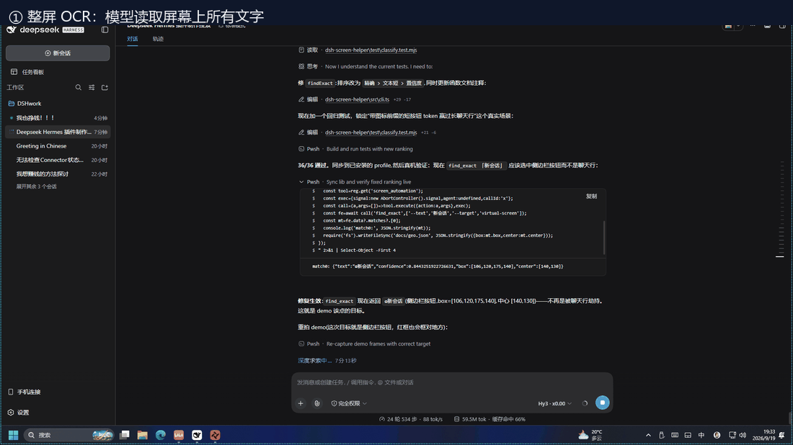

# dsh-screen-helper

> 让 AI 模型**看你的屏幕、动你的鼠标、敲你的键盘**——一句话，就为你点开那个按钮。

一个 [DeepSeek Harness](https://github.com/deepseek-ai/deepseek-harness)（dsh）插件，给模型一个工具
—— `screen_automation` —— 用来驱动 **屏幕自动化小助手 / ScreenAutomationHelper** 桌面自动化 CLI：
截屏、OCR 文字识别、屏幕上文字/图像定位、UI 控件树读取，以及鼠标 / 键盘 / 剪贴板操作。



> **安装前请先读 [安全](#安全) 一节。** 这个插件会让 AI 模型移动你真实的鼠标、敲你真实的键盘、
> 读取你的屏幕和剪贴板。

---

## 环境要求

| 组件 | 要求 |
| --- | --- |
| DeepSeek Harness | `0.1.5-rc.1` 或兼容的 `0.1.5` 版本 |
| Node.js | `^22.19.0 \|\| >=24.0.0` |
| ScreenAutomationHelper | 本地已安装（Windows）。本文档默认路径：`D:\ScreenAutomationHelper\ScreenAutomationHelper.exe` |
| 操作系统 | Windows 10/11 |

> **`find_exact` 与 `screen.find` 的区别**：`screen.find` 返回的是**包含命中词的整行**框，点击会落到行中间；
> `find_exact` 复用 `screen.recognize` 的**单词级** OCR，返回**精确命中词**的框。要点按钮、点标签时优先用 `find_exact`。

> **UI 树点击（`ui.click`）**：先用 `ui.find` 按**无障碍身份**（role/name）确认控件存在，再自动用 `find_exact` 拿到屏幕上像素坐标并点击。比纯 OCR 稳——它先证明"这个控件是真的"，不会因 OCR 误识别点到同名文字。控件不存在时**明确报错、绝不乱点**。
> 注意：SAH 的 UI 树（`ui.tree`/`ui.find`）只暴露**身份与层级**，不暴露元素几何坐标，所以 `ui.click` 仍按解析出的像素点击，而非按元素句柄。对 Electron 类应用（如 DSH 桌面本身）UI 树节点可能不暴露名字，此时退回 `find_exact` 或显式 `mouse.click --point`。


小助手是**独立的第三方产品**，不随本插件分发。如果 `health` 返回 `SPAWN_FAILED`，
说明小助手没装或 `cliPath` 配错了。

## 安装

> ⚠️ **平台前提：本插件只能在 Windows 上运行。** 它驱动的是
> [屏幕自动化小助手 / ScreenAutomationHelper](https://github.com/) —— 一个 Windows 桌面自动化
> 程序（GUI + OCR + 鼠标键盘模拟）。macOS / Linux 上没有这个 CLI，装了也用不了。下方命令也假定
> 你已经在用 Windows 版的 DeepSeek Harness。

**方式一：从 GitHub Release 一键装（推荐）**

```powershell
# Windows PowerShell
dsh plugin --profile desktop add https://github.com/helloo-666/dsh-screen-helper/releases/download/v0.1.0/dsh-screen-helper-0.1.0.tgz
```

**方式二：从本地源码 / git 仓库**

```bash
dsh plugin --profile desktop add ./dsh-screen-helper          # 本地目录
dsh plugin --profile desktop add ./dsh-screen-helper-0.1.0.tgz # 本地打包产物
git clone https://github.com/helloo-666/dsh-screen-helper.git
dsh plugin --profile desktop add ./dsh-screen-helper          # clone 后
```

装完**重启该 profile**。确认插件行已生效：

```bash
dsh --profile desktop --dump-config
```

> ⚠️ **必看：`cliPath` 必须手动配。**
> `dsh plugin add` 会把插件声明的默认值 `cliPath: ''` 写进 profile。这个默认值会从 `PATH`
> 里找 `ScreenAutomationHelper.exe`，而**小助手的安装程序不会把自己加进 `PATH`**——所以刚装完
> 每一次调用都会失败，直到你在 profile 的 `cordis.patch.yml` 里写上绝对路径。

### 自动安装脚本

仓库里附带 `install.ps1`，一条命令完成「装插件 + 写入 cliPath + 选审批档」：

```powershell
# 默认 approval=always，cliPath 取 SAH 默认安装位置
.\install.ps1

# 或显式指定
.\install.ps1 -CliPath 'D:\ScreenAutomationHelper\ScreenAutomationHelper.exe' -Approval mutating
```

脚本会：① 把 release tarball 下到临时目录并通过 `dsh plugin add` 安装；② 在 profile 的
`cordis.patch.yml` 里补上 `cliPath` 与 `approval` 两项配置（已存在则跳过）。它不碰你其它插件。

## 配置

在 profile 的 `cordis.patch.yml` 里：

```yaml
- id: screen-helper
  config:
    # 可执行文件绝对路径。留空 = 从 PATH 找 "ScreenAutomationHelper.exe"。
    cliPath: 'D:\ScreenAutomationHelper\ScreenAutomationHelper.exe'
    # 单次调用超时。
    timeoutMs: 60000
    # 'always'   = 每一次调用都弹窗询问（包括 status 这类只读查询）。
    # 'mutating' = 只有鼠标/键盘/剪贴板写入/状态变更才询问。
    # 'never'    = 全部直接执行，不询问。（默认）
    approval: always
    # true = 无论是否批准，一律拒绝 workflow 变更和剪贴板写入。
    blockDestructive: false
```

### 三档审批策略怎么选

| 配置 | 行为 | 适合 |
| --- | --- | --- |
| `always` | **每次调用都弹窗**，包括 `status`、`health` 这类只读查询 | 不放心、想全程盯着，或机器上有敏感内容 |
| `mutating` | 只有鼠标/键盘/剪贴板写入/状态变更才弹窗，只读查询静默通过 | 日常使用，平衡打扰与安全 |
| `never` | 全部直接执行，不询问（默认） | 单用户、人在场、完全信任 |

`always` 和 `mutating` 都走 dsh 原生审批服务，它是 **fail-closed** 的：没有应答器、用户取消、
应答器抛异常，一律**拒绝**而不是放行。**拒绝时连返回数据都是 `null`**——不会偷偷把屏幕内容
或剪贴板内容泄露给模型。

> 如果你给陌生人发布这个插件，**请把补丁层里的 `approval` 设为 `mutating` 或 `always`**。
> 默认的 `never` 是给完全信任的场景准备的。

## 用法

模型拿到的是**一个**工具，参数是 `action` 加上一个 CLI 参数数组 `args`：

```jsonc
{ "action": "screen.recognize", "args": ["--target", "foreground"] }
{ "action": "screen.find", "args": ["--text", "登录"] }
{ "action": "find_exact", "args": ["--text", "登录", "--target", "virtual-screen"] }
{ "action": "mouse.click", "args": ["--point", "842,516", "--button", "left"] }
```

典型流程：`screen.recognize` 或 `ui.tree` 看状态 → `screen.find`（行级）或 `find_exact`（词级精确框）拿坐标
→ `mouse.click` 点击。**要点具体的标签或按钮，用 `find_exact`**——它返回的是命中词本身的框，而不是整行。
坐标是屏幕绝对像素；多显示器请先调 `screen.monitors`。

### 为什么是一个工具而不是四十个

小助手暴露约 42 个能力族。给每个子命令注册一个 dsh 工具会挤爆模型的工具列表，反而让它忽略
真正重要的工具。用一个工具 + 带风险分级的 action 目录，既保持命名空间小，又能触达整条 CLI。

### 按风险分级

| 分级 | 行为 | 例子 |
| --- | --- | --- |
| `read` | 永不询问，纯查询 | `status`、`capabilities`、`health`、`runs.list`、`workflow.list` |
| `observe` | 永不询问，但会暴露屏幕内容 | `screen.capture`、`screen.recognize`、`ui.tree`、`clipboard.read` |
| `mutate` | `approval: mutating` 时会询问 | `mouse.click`、`keyboard.write`、`clipboard.write`、`workflow.install` |

**不在** read/observe 表里的子命令一律按 `mutate` 处理，所以小助手未来版本新增的命令会被自动
拦截，而不是因为白名单没更新就悄悄放行。

## 安全

**这个插件把物理输入设备的控制权交给 AI 模型。安装前请想清楚后果。**

- **鼠标和键盘操作不可撤销。** 插件能点下一个按钮，但**不能**取消这次点击。付款确认、消息发送、
  文件删除、账号变更都能通过 `mouse.click` / `keyboard.write` 触达，而且**取消工具调用并不会撤销
  已经发生的操作**。
- **没有沙箱兜底。** dsh 的文件沙箱约束的是文件写入，约束不了一个合成操作系统级输入事件的程序。
  这个工具驱动的是真实桌面。
- **屏幕读取可能泄露机密。** `screen.capture`、`screen.recognize`、`clipboard.read` 能返回屏幕
  上或剪贴板里的任何内容，包括密码、令牌、私密消息，而且这些结果会写进会话日志。
- **结果会被持久化。** 工具输出会追加到会话日志，抓到什么就留在那里。
- **`workflow.install` 会执行来源代码。** 安装一个 workflow 就意味着信任那个来源。
  `blockDestructive: true` 会直接禁用这一族。

### 已内置的缓解措施

- 参数以真正的 `argv` 数组跨进程传递，`shell: false`。含 `; rm -rf /` 或 `$(whoami)` 的值会被
  当成普通文本，永不执行。这也是本工具收 `args` 数组而不收命令字符串的原因。
- NUL 字节或超长参数在启动进程前就被拒绝。
- 每次调用都有超时；取消会把 kill 转发给子进程。
- `approval: mutating` 通过 dsh 的 fail-closed 审批服务拦下整个 `mutate` 分级。
- `blockDestructive: true` 即使已批准也拒绝 workflow 变更和剪贴板写入。
- 模型只能触达小助手自己的 `cli` 子命令树，无法传入任意可执行文件或任意子命令路径。

### 本插件**不能**防住什么

一个下定决心、且处于默认配置（`approval: never` + `blockDestructive: false`）的模型可以随意
操作你的桌面。默认值是给"单用户、操作者在场看着"的场景选的。**如果你要把它发布给陌生人，
请在补丁层里带上 `approval: mutating`** —— 严格策略只差一行，而这一行就是"有用的工具"和
"无人值守的远程控制通道"之间的区别。

## 设计取舍：为什么 `ui.click` 是「身份确认 + 像素点击 + 反向验证」

UI 自动化 agent 主流有两种范式，本插件取了两者的组合，并受小助手（SAH）能力边界约束：

- **视觉范式（OpenAI CUA / Codex Computer Use / Operator）**：模型看截图，直接在像素坐标上
  `click(x,y)`。好处是通用——任何屏幕上画出来的东西都能点；坏处是像素脆：布局一抖、动画一晃、
  重叠一个元素，就点到错的地方。业界有整篇文章专门讲「点对了按钮、点错了屏幕」的失败。
- **可访问性树范式**：用 UI 控件的 role/name（无障碍身份）定位，拿到**稳定 ID**，不随像素漂移。
  对按钮、菜单、表单这类「有稳定名字」的控件，AX 树能覆盖生产环境里约 95% 的点击。

本插件的设计：

1. **`ui.find` 做身份确认**（对齐 AX 树范式）。先证明「叫这个名字的控件真的存在」，而不是盲目
   相信 OCR 看到的文字。控件不存在 / 重名歧义时，`ui.click` 明确报错、**绝不乱点**。
2. **`find_exact`（OCR）做像素解析**（对齐视觉范式的落点）。SAH 的 `ui.find` 在小助手当前版本
   **不返回元素几何坐标**（只给 role/name；Electron 类应用甚至不暴露名字），所以像素仍来自 OCR。
3. **`--verify` 做闭环验证**（对齐 CUA「点击后核对」的做法）。点完用 `ui.inspect --point` 反查
   「光标下实际是哪个控件」，比对 role/name 是否匹配预期。不匹配就报告
   `clicked+verify-mismatch`，把「点错屏幕」的风险暴露出来，而不是静默成功。

> 为什么不直接「AX 树拿坐标 → 点」？因为 SAH 当前 `ui.find` 不带几何（已实测确认）。等小助手
> 在 `ui.find` 里补上 `bounds_screen`（它其实在单次 `ui.inspect` 里已有），`ui.click` 可以跳过
> OCR 这步，变成纯 AX 树定位——届时本插件的接口无需改动。

## 开发

```bash
pnpm install
pnpm run build     # tsc -> lib/
pnpm test          # 26 个测试：分级、真实 CLI 端到端、插件契约
```

小助手不存在时，端到端套件会**跳过**而不是失败。用 `SAH_CLI` 指定其他路径：

```bash
SAH_CLI=/path/to/ScreenAutomationHelper.exe pnpm test
```

### 真机验证脚本

以下三个会驱动真实屏幕，因此**不属于** `pnpm test`。它们存在的意义是：让上面那些安全声明
可以被复现，而不是只能被相信。请在能看见鼠标移动的机器上运行。

```bash
pnpm run smoke              # 发现、OCR、UI 树、剪贴板、小幅移动鼠标
pnpm run verify:roundtrip   # 定位 -> 移动 -> 独立复核 -> 恢复原状
pnpm run verify:approval    # 证明审批门真的拦住了执行
pnpm run verify:always      # 证明 always 模式下每次调用都询问
```

还有一组 `scripts/play-*.mjs`，是一次真机把玩留下的痕迹，可以逐个运行：

```bash
node scripts/can-i-use.mjs       # 三档分级是否都能真实执行
node scripts/accuracy.mjs        # 鼠标定位精度（8 个点）—— 实测 0 偏差
node scripts/find-and-click.mjs  # 找字 -> 移动 -> 验证落在目标框内
node scripts/play-calculator2.mjs # 启动计算器 -> 键盘输入 -> OCR 回读结果
node scripts/play-close-notepad3.mjs # task.begin -> activate -> 关闭窗口
```

`accuracy.mjs` 顺带证实了一件事：`mouse.move --duration` 是**动画**。带 duration 时立刻读
`mouse.position` 会读到飞行中的中间坐标（曾观测到请求 `(300,300)` 实测 `(309,299)`），
等 250ms 稳定后再读就是精确值。**不是精度问题，是竞态。**

`play-calculator.mjs` 是**故意保留的失败案例**：它尝试用 `screen.find` 点计算器按钮，结果
`7` 和 `=` 定位失败。对照 `play-calculator2.mjs`（改用键盘）可以直观看到上面第 4 个坑。

`verify:approval` 是其中最关键的。它先把光标停在某处，然后在应答器返回 `rejected` 的情况下
让工具去移动光标，最后**重新读取光标位置**来确认这次移动根本没发生——依据是可观测的硬件状态，
而不是某个返回值：

```
【拒绝】mouse.move -> (100,100)
  executed=false  blockedReason=the user did not approve this action (rejected)
  光标实际位置=(600, 600)  <-- 必须仍是 600,600
  拦截成功=true
【同意】mouse.move -> (100,100)
  光标实际位置=(100, 100)  <-- 应该是 100,100
  放行成功=true
【失败模式】无应答器: executed=false 泄漏=否 (正确)
【失败模式】应答器抛异常: executed=false 泄漏=否 (正确)
【失败模式】返回垃圾值: executed=false 泄漏=否 (正确)
```

注意 `mouse.position` 本身也被分级为 `mutate`，所以拒绝点击的策略同样会拒绝回读。
脚本会临时装回一个可用的应答器来观测真实光标位置——这正是收窄 `approval` 前值得先读一遍
分级表的原因。

### 小助手 CLI 的四个坑

这些契约**没有写在 `-h` 里**，是在真机上撞出来的。写下来是因为每一个都能安静地失败——
不报错、不抛异常，只是"什么都没发生"。

**1. 它不能启动程序。** 没有 `run` / `exec` / `launch` 子命令。`task.begin` 是**绑定一个已经存在的
窗口**，不是开新进程。要开程序得自己 `spawn`，再让插件去驱动它。

**2. 窗口控制需要"已确认的任务目标"。** `window.activate` 单独调用一定失败：

```json
{"ok": false, "status": "window_control_failed", "error": "当前没有已确认的屏幕任务目标"}
```

必须先 `task.begin` 建立目标。**好在目标是落盘持久化的**，所以两条命令分属不同进程也能接上：

```
task.begin (--handle/--title/--process)  ->  window.activate  ->  keyboard.*
        |                                          ^
        +-- 写入 agent_screen_task.json -----------+
```

**3. `window.activate` 不接 `--handle`。** 它的签名是 `activate [--target TARGET]`。传 `--handle`
会被**静默忽略**（返回 `null`），窗口不动，但也不报错。`window.select` 那个"选中状态"是
**进程内**的，跨 `cli` 调用不保留——别指望 `select` 完再 `activate`。

**4. 单字符 OCR 不可靠。** 计算器的 `7` 被认成 `⑧`、`=` 被认成 `二`。所以
`screen.find` **不适合点计算器按钮这类单字符目标**。要输入表达式就直接 `keyboard.write`，
别去找按钮。

### 目录结构

```
src/cli.ts        风险分级、argv 构造、进程启动、JSON 解析
src/index.ts      defineTool 注册、审批门、面向模型的使用手册
scripts/          真机验证（smoke、roundtrip、approval-gate）+ play-* 把玩记录
cordis.patch.yml  dsh 折叠进 profile 的 bundle 层
test/             node:test 测试套件
```

## 许可证

MIT。ScreenAutomationHelper（屏幕自动化小助手）本身是独立产品，遵循其自身 EULA，不随本插件分发。
